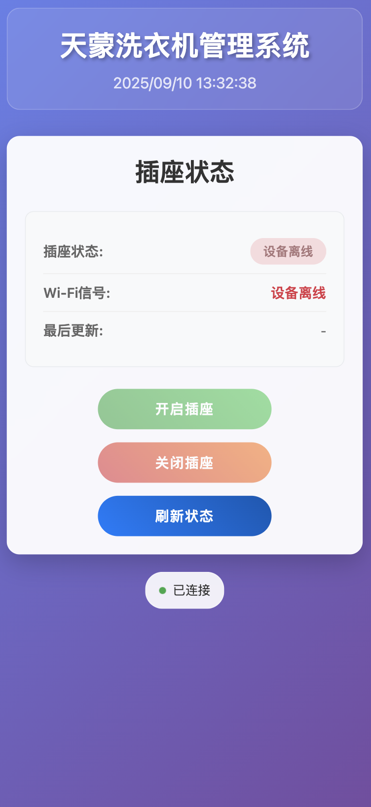

# 天蒙洗衣机管理系统

一个基于MQTT通讯的智能插排管理网站，支持钉钉验证码验证功能。

## 功能特性

- 🔌 实时显示插座开关状态
- 📶 显示Wi-Fi信号强度
- 🔐 钉钉机器人验证码安全验证
- 🔄 实时状态更新（WebSocket）
- 📱 响应式设计，支持移动端
- ⚡ 简洁现代的用户界面

## 系统要求

- Python 3.7+
- 网络连接
- 钉钉群机器人（可选）

## 项目截图

|  |  |
| ---------------------------------- | ---------------------------------- |


## 安装步骤

1. **克隆或下载项目文件**

2. **安装Python依赖**
   ```bash
   pip install -r requirements.txt
   ```

3. **钉钉机器人已配置**
   - 系统已预配置钉钉机器人，验证码将自动发送到指定钉钉群
   - 如需修改钉钉配置，请编辑 `app.py` 文件中的以下变量：
   ```python
   DINGTALK_WEBHOOK = "YOUR_WEBHOOK_URL"
   DINGTALK_SECRET = "YOUR_SECRET_KEY"
   ```

4. **运行应用**
   ```bash
   python app.py
   ```

5. **访问网站**
   - 在浏览器中打开 `http://localhost:5000`
   - 如果部署在服务器上，使用服务器IP地址访问


## 插座控制指令

| 指令 | 设备返回 | 功能说明 |
|------|----------|----------|
| a1   | n1       | 开关打开 |
| b1   | f1       | 开关关闭 |
| q1   | n1/f1    | 查询开关状态 |
| qs   | s-xx     | 获取设备Wi-Fi信号 |
| rest | rest_ok  | 重启设备 |

## 使用说明

### 插座控制流程

1. 点击"开启插座"或"关闭插座"按钮
2. 系统生成6位数字验证码
3. 验证码会发送到钉钉群（如已配置）或显示在控制台
4. 在弹出的对话框中输入验证码
5. 验证成功后，系统发送MQTT指令控制插座
6. 页面实时更新插座状态

### 功能按钮

- **开启插座**: 发送开启指令
- **关闭插座**: 发送关闭指令  
- **刷新状态**: 查询当前插座状态和Wi-Fi信号

### 快捷键

- `Ctrl+R` / `Cmd+R`: 刷新状态
- `ESC`: 关闭验证码对话框
- `Enter`: 在验证码输入框中提交验证码

## 项目结构

```
.
├── app.py                 # Flask后端应用
├── requirements.txt       # Python依赖
├── README.md             # 项目说明
├── templates/
│   └── index.html        # 主页模板
└── static/
    ├── css/
    │   └── style.css     # 样式文件
    └── js/
        └── app.js        # 前端JavaScript
```

## 安全特性

- 验证码5分钟自动过期
- 验证码使用后立即销毁
- 支持多用户并发使用
- 自动清理过期验证码

## 故障排除

### 常见问题

1. **MQTT连接失败**
   - 检查网络连接
   - 确认MQTT服务器地址和端口正确
   - 查看控制台错误信息

2. **钉钉消息发送失败**
   - 检查webhook URL和密钥是否正确
   - 确认钉钉机器人配置正确，包括签名认证
   - 查看控制台输出的具体错误信息

3. **页面无法加载**
   - 确认Flask应用正在运行
   - 检查端口5000是否被占用
   - 查看防火墙设置

### 调试模式

编辑 `app.py`，设置 `debug=True` 以启用调试模式：
```python
socketio.run(app, host='0.0.0.0', port=5000, debug=True)
```

## 部署建议

### 生产环境部署

1. 使用Gunicorn作为WSGI服务器
2. 使用Nginx作为反向代理
3. 配置HTTPS证书
4. 设置防火墙规则

### Docker部署

可以创建Dockerfile来容器化部署：
```dockerfile
FROM python:3.9-slim
WORKDIR /app
COPY requirements.txt .
RUN pip install -r requirements.txt
COPY . .
EXPOSE 5000
CMD ["python", "app.py"]
```

## 技术栈

- **后端**: Flask + Flask-SocketIO
- **MQTT客户端**: paho-mqtt
- **前端**: HTML5 + CSS3 + JavaScript ES6
- **实时通讯**: WebSocket
- **消息推送**: 钉钉机器人API

## 版权说明

本项目仅供学习和个人使用。

## 支持

如有问题或建议，请检查：
1. 控制台输出的错误信息
2. 浏览器开发者工具的网络和控制台选项卡
3. MQTT连接状态和消息日志 